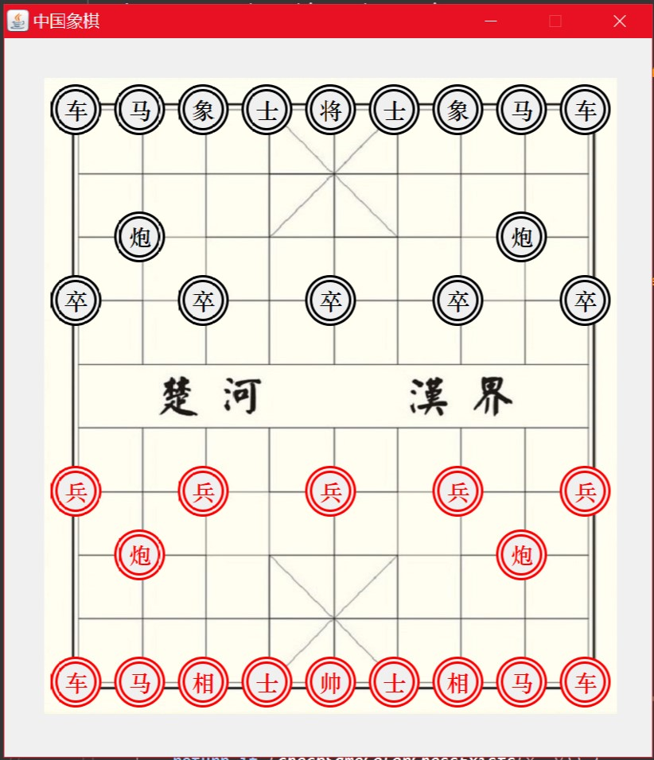

#Chinese Chess

期望实现一个带AI的象棋游戏

界面:


有步骤记录功能,类似于:
```
中国象棋游戏记录:
最终游戏状态:ENDED
胜利者: 红方

先手: 用户
用户颜色: RED
电脑颜色: BLACK
红方让子: 
黑方让子: 
棋局规定总时长(秒): 9223372036854775807 
每步规定时长(秒): 30 

初始状态矩阵:
[51,  0,  0, 71,  0,  0, 70,  0,  0, 52]
[41,  0, 61,  0,  0,  0,  0, 62,  0, 42]
[31,  0,  0, 73,  0,  0, 72,  0,  0, 32]
[21,  0,  0,  0,  0,  0,  0,  0,  0, 22]
[11,  0,  0, 75,  0,  0, 74,  0,  0, 12]
[23,  0,  0,  0,  0,  0,  0,  0,  0, 24]
[33,  0,  0, 77,  0,  0, 76,  0,  0, 34]
[43,  0, 63,  0,  0,  0,  0, 64,  0, 44]
[53,  0,  0, 79,  0,  0, 78,  0,  0, 54]
走棋过程:
RED : 车九进1 { (0,0) -> (0,1) }
BLACK : 炮2进1 { (1,7) -> (1,6) }
RED : 车九平六 { (0,1) -> (3,1) }
BLACK : 炮8进1 { (7,7) -> (7,6) }
RED : 车六进7 { (3,1) -> (3,8) }
BLACK : 炮2进1 { (1,6) -> (1,5) }
RED : 车一进1 { (8,0) -> (8,1) }
BLACK : 炮8进1 { (7,6) -> (7,5) }
RED : 车一平四 { (8,1) -> (5,1) }
BLACK : 炮8退2 { (7,5) -> (7,7) }
RED : 车四进7 { (5,1) -> (5,8) }
BLACK : 炮2退2 { (1,5) -> (1,7) }
RED : 炮二平五 { (7,2) -> (4,2) }
BLACK : 卒7进1 { (6,6) -> (6,5) }
RED : 炮五进4 { (4,2) -> (4,6) }
BLACK : 炮8进1 { (7,7) -> (7,6) }
RED : 车四平五 { (5,8) -> (4,8) }
最终状态矩阵:
[ 0,  0,  0, 71,  0,  0, 70,  0,  0, 52]
[41,  0, 61,  0,  0,  0,  0, 62,  0, 42]
[31,  0,  0, 73,  0,  0, 72,  0,  0, 32]
[21,  0,  0,  0,  0,  0,  0,  0, 51, 22]
[11,  0,  0, 75,  0,  0, 63,  0, 53, 12]
[23,  0,  0,  0,  0,  0,  0,  0,  0, 24]
[33,  0,  0, 77,  0, 76,  0,  0,  0, 34]
[43,  0,  0,  0,  0,  0, 64,  0,  0, 44]
[ 0,  0,  0, 79,  0,  0, 78,  0,  0, 54]


```